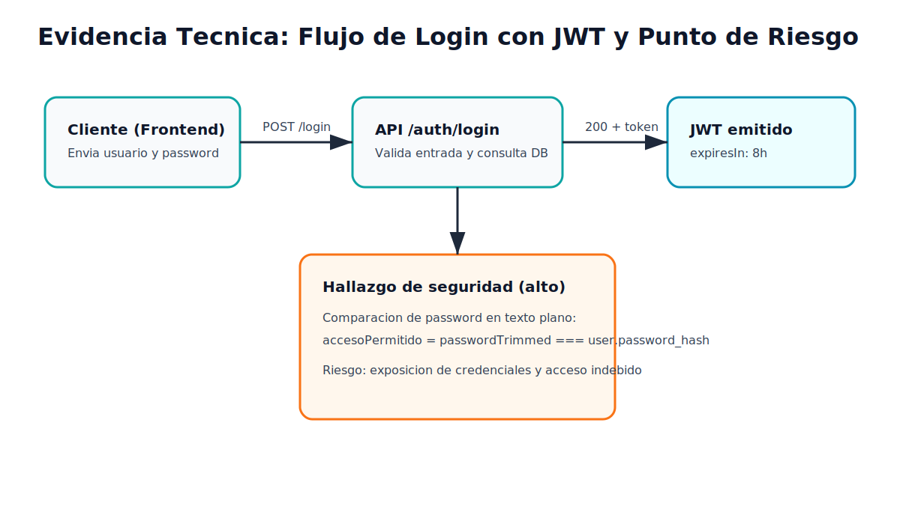
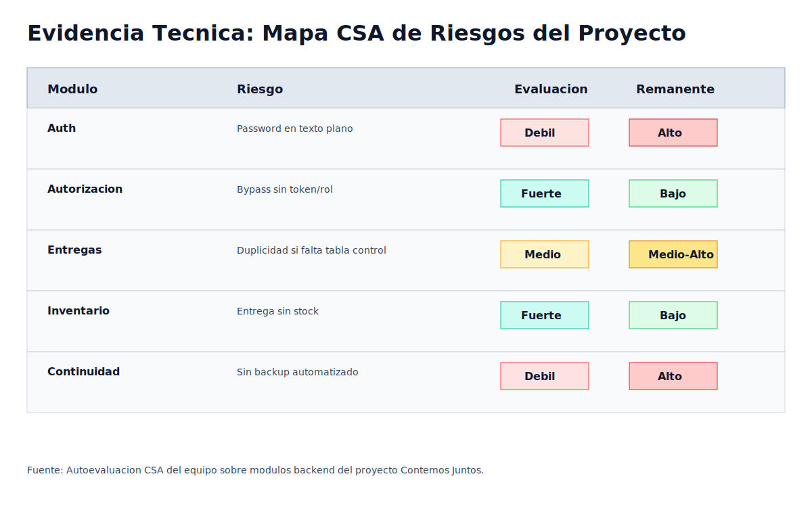

# GUIA DE LABORATORIO: AUDITORIA INTERNA, CSA Y ETICA PROFESIONAL

Asignatura: Auditoria de Sistemas

Semana: 11

Duracion: 1 - 2 horas

Modalidad: Aplicacion al Proyecto de Software Grupal

## 1. INTRODUCCION

En el proyecto Contemos Juntos, la Autoevaluacion de Control (CSA) permite revisar de manera preventiva la seguridad, la integridad y la trazabilidad del software antes de una auditoria externa. Esta guia documenta controles reales del sistema, riesgos remanentes y acciones concretas de mejora con soporte tecnico verificable.

## 2. OBJETIVO

Aplicar la metodologia CSA y el estandar de hallazgos (3C + E + R) al proyecto de software grupal, aportando evidencia tecnica real del codigo y reflexionando sobre la responsabilidad etica del equipo en la transparencia digital.

## 3. ACTIVIDAD 1: MATRIZ CSA CON EVIDENCIA DIGITAL

Proyecto auditado: Sistema de Control y Trazabilidad de Ayudas Humanitarias (Contemos Juntos).

Nota de evidencia: en la columna de evidencia se incluye la ruta verificable y el punto donde debe tomarse la captura de pantalla.

### Evidencia visual insertada

| Proceso / Modulo | Riesgo Identificado | Control Existente | Evaluacion (Fuerte/Medio/Debil) | Evidencia (Descripcion y Captura de Pantalla) | Riesgo Remanente |
| :---- | :---- | :---- | :---- | :---- | :---- |
| Seguridad de acceso | Exposicion de credenciales por comparacion de contrasenas en texto plano | Validaciones de entrada y emision de JWT en login | Debil | Descripcion: el login valida formato, pero compara contrasena directa con campo password_hash sin bcrypt.compare. Captura de [backend/controllers/authController.js](../backend/controllers/authController.js#L33) y [backend/controllers/authController.js](../backend/controllers/authController.js#L35). | Alto |
| Autenticacion y autorizacion | Acceso a recursos sin token o rol valido | Middleware de verificacion de token y rol | Fuerte | Descripcion: se valida Authorization, jwt.verify y roles permitidos antes de continuar. Captura de [backend/middlewares/authMiddleware.js](../backend/middlewares/authMiddleware.js#L3) y [backend/middlewares/authMiddleware.js](../backend/middlewares/authMiddleware.js#L19). | Bajo |
| Integridad de entregas | Duplicidad de ayudas a una misma familia en el mismo periodo | Validacion de duplicidad y bloqueo por control_entrega_familia | Medio | Descripcion: existe validacion de duplicidad; si la tabla no existe, el flujo continua y debilita el control. Captura de [backend/controllers/entregasController.js](../backend/controllers/entregasController.js#L33) y [backend/controllers/entregasController.js](../backend/controllers/entregasController.js#L43). | Medio-Alto |
| Integridad de inventario | Entrega con stock insuficiente o lote no disponible | Validacion de lote y cantidad con transaccion y FOR UPDATE | Fuerte | Descripcion: se verifica estado del lote y cantidad disponible antes de descontar inventario. Captura de [backend/controllers/entregasController.js](../backend/controllers/entregasController.js#L90) y [backend/controllers/entregasController.js](../backend/controllers/entregasController.js#L104). | Bajo |
| Disponibilidad / continuidad | Perdida de datos por ausencia de respaldos automatizados documentados | No existe evidencia de script/servicio de backup en backend | Debil | Descripcion: no se identifica modulo activo de backups en el proyecto. Captura de estructura de carpeta [backend](../backend) mostrando ausencia de backup automatizado. | Alto |
| Calidad operativa y trazabilidad | Dificultad para auditoria posterior por logs no estructurados | Manejo de errores con console.error y mensajes HTTP | Medio | Descripcion: hay manejo de excepciones, pero sin bitacora centralizada o SIEM. Captura de [backend/server.js](../backend/server.js#L23) y [backend/controllers/inventarioController.js](../backend/controllers/inventarioController.js#L45). | Medio |

Cumplimiento del requisito: se identifican 6 riesgos (minimo solicitado: 5).

## 4. ACTIVIDAD 2: REDACCION DE HALLAZGOS (METODO 3C, E y R)

### Hallazgo 1: Gestion insegura de contrasenas

Condicion (C):
En el flujo de autenticacion, la contrasena ingresada se compara de forma directa con el valor almacenado en base de datos (password_hash), sin aplicar verificacion criptografica.

Criterio (C):
Incumplimiento de buenas practicas OWASP ASVS (almacenamiento y verificacion segura de credenciales) e ISO/IEC 25010 en la caracteristica de seguridad (confidencialidad).

Causa (C):
Decisiones tecnicas iniciales para acelerar el desarrollo, manteniendo compatibilidad con una base de datos existente sin migracion de hashes.

Efecto (E):
Mayor riesgo de compromiso de cuentas, escalamiento de privilegios y exposicion de datos sensibles si la base de datos es filtrada.

Recomendacion (R):
Implementar hash seguro con bcrypt: migrar gradualmente credenciales a hash, usar bcrypt.compare en login, y forzar cambio de contrasena para usuarios antiguos.

Evidencia:
[backend/controllers/authController.js](../backend/controllers/authController.js#L33)

### Hallazgo 2: Control de duplicidad dependiente de tablas opcionales

Condicion (C):
La validacion de duplicidad y algunos registros de control se ejecutan dentro de bloques try/catch que permiten continuar la operacion cuando la tabla de control no existe.

Criterio (C):
Debilidad frente al principio de integridad de datos y trazabilidad; incumple el criterio de control preventivo robusto en procesos de entrega.

Causa (C):
Diseno orientado a tolerar esquemas de BD incompletos en diferentes entornos sin imponer precondiciones de despliegue.

Efecto (E):
Posibilidad de entregas duplicadas en periodos iguales, inconsistencias historicas y dificultad para detectar fraude operativo.

Recomendacion (R):
Convertir las tablas de control en prerequisito obligatorio (migraciones), fallar en modo seguro cuando falten objetos criticos y agregar pruebas de integridad en pipeline CI.

Evidencia:
[backend/controllers/entregasController.js](../backend/controllers/entregasController.js#L33)

### Hallazgo 3: Ausencia de respaldo automatizado y bitacora formal

Condicion (C):
No se evidencia un proceso formal de backup automatizado ni una bitacora de auditoria estructurada para eventos criticos.

Criterio (C):
Incumplimiento parcial de controles de continuidad del negocio y recuperacion ante desastres (ISO 27001 A.12 / A.17, buenas practicas operativas).

Causa (C):
Prioridad del equipo en funcionalidades de negocio y pruebas funcionales, dejando controles operativos para una fase posterior.

Efecto (E):
Riesgo alto de perdida de informacion ante falla de infraestructura y menor capacidad forense para reconstruir incidentes.

Recomendacion (R):
Implementar politica de backup diario con retencion definida, pruebas periodicas de restauracion, y logging estructurado centralizado (por ejemplo, Winston + almacenamiento persistente).

Evidencia:
[backend](../backend)

## 5. ACTIVIDAD 3: ETICA Y COMPETENCIAS CIUDADANAS

### Reflexion critica

El auditor de software no solo valida que el sistema "funcione"; tambien protege la confianza publica en la informacion digital. En Contemos Juntos, esta responsabilidad es especialmente sensible porque la plataforma gestiona ayudas humanitarias. Cualquier alteracion, omision o manipulacion en los registros de familias, inventario o entregas puede traducirse en injusticias reales para personas en condicion de vulnerabilidad.

Desde la perspectiva de transparencia, el software aporta controles importantes: autenticacion con token, validacion de roles, transacciones para entregas y controles de stock. Estos elementos ayudan a reducir errores operativos y a dejar evidencia de decisiones en el flujo de negocio. Sin embargo, la transparencia no es solo tener funcionalidades; exige que los controles sean consistentes en todos los entornos y que no dependan de condiciones opcionales. Cuando un control puede omitirse si falta una tabla o una configuracion, se crea un espacio de discrecionalidad que compromete la confiabilidad del sistema.

Sobre riesgos de manipulacion de datos, el equipo tiene una responsabilidad etica doble. Primero, proteger datos personales de las familias beneficiarias (identificacion, direccion, historial de entregas). Segundo, garantizar que la informacion operativa no pueda ser alterada sin trazabilidad. En este punto, decisiones como mantener contrasenas sin hash o no tener auditoria estructurada no son solo "deuda tecnica"; son riesgos eticos, porque pueden facilitar accesos indebidos y afectar derechos de terceros. Por ello, la etica profesional exige anticipacion: aplicar controles antes de incidentes, no despues.

Una auditoria honesta contribuye al impacto social porque fortalece la legitimidad de la tecnologia ante la ciudadania. Cuando un sistema de ayudas puede demostrar controles claros, evidencias verificables y mejora continua, aumenta la percepcion de justicia y reduce sospechas de favoritismo o fraude. En contraste, cuando los controles son debiles o no existen evidencias, incluso un sistema funcional pierde credibilidad.

Como equipo de ingenieria, la competencia ciudadana implica tomar decisiones tecnicas con criterio humano. No basta con cumplir requisitos minimos de entrega academica; se debe construir software responsable, auditable y alineado con el interes publico. Esto se traduce en acciones concretas: reforzar seguridad de credenciales, estandarizar backups, formalizar bitacoras, y someter periodicamente el sistema a revisiones internas (CSA) y externas.

En conclusion, el auditor es un garante de la transparencia digital porque convierte hechos tecnicos en confianza social. En proyectos con impacto comunitario, auditar con rigor y etica no es opcional: es parte esencial del compromiso profesional del ingeniero.

## 6. CRITERIOS DE EVALUACION (AUTO-CHEQUEO)

| Criterio | Evidencia en este documento |
| :---- | :---- |
| Matriz CSA y calidad de evidencias (30%) | Cumplido: 6 riesgos con evidencia trazable en codigo y modulos del proyecto |
| Redaccion de hallazgos 3C + E + R (25%) | Cumplido: 3 hallazgos completos y tecnicos |
| Reflexion etica (20%) | Cumplido: reflexion estructurada y orientada a transparencia digital |
| Coherencia tecnica (15%) | Cumplido: riesgos reales del proyecto auditado |
| Presentacion y referencias (10%) | Parcial: revisar APA final segun formato de entrega institucional |

## Referencia sugerida

Sevilla Tendero, J. (2019). Auditoria de los sistemas integrados de gestion. Fundacion Confemetal.
